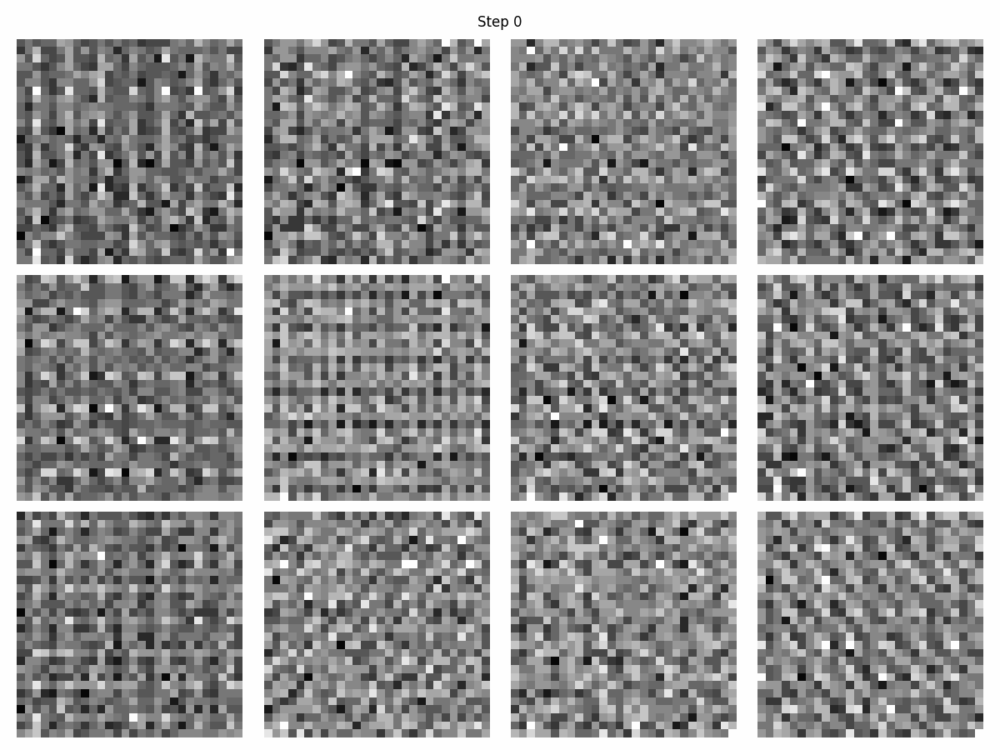

# Image Generation Transformer

A PyTorch-based Vision Transformer Variational Autoencoder (VAE) for image generation and reconstruction.



## Overview

This project implements a **TransformerVAE** that combines Vision Transformer architecture with Variational Autoencoder principles. The model learns to encode images into latent representations and decode them back to reconstructed images, enabling both image reconstruction and generation.

## Architecture

### Key Components

- **TransformerEncoder**: Converts full images to latent vectors using patch embeddings and transformer layers
- **TransformerDecoder**: Converts latent vectors back to full images using transformer layers and patch decoding  
- **TransformerVAE**: Main model that combines encoder and decoder with VAE sampling

### Design Principles

- **Clean Separation**: Encoder and decoder handle full images and patch operations internally
- **VAE Integration**: Proper variational autoencoder with reconstruction and KL divergence losses
- **Patch-based Processing**: Efficient image processing using configurable patch sizes
- **Self-attention**: Multi-head attention mechanisms for capturing image dependencies

## Features

- ✅ **Working Training Pipeline**: Complete training loop with MNIST dataset
- ✅ **Progress Visualization**: Automatic generation of training progress plots
- ✅ **GIF Animation**: Creates animated GIF showing training progress
- ✅ **Model Persistence**: Save/load functionality with metadata preservation
- ✅ **Device Support**: CPU, CUDA, and Apple Silicon (MPS) support
- ✅ **Flexible Dimensions**: Configurable image sizes, patch sizes, and model dimensions

## Quick Start

### Installation

```bash
# Clone the repository
git clone <your-repo-url>
cd img-gen-transformer

# Create and activate virtual environment
python -m venv .venv
source .venv/bin/activate  # On Windows: .venv\Scripts\activate

# Install dependencies
pip install -r requirements.txt
```

### Training

```bash
# Train the model on MNIST dataset
python train.py
```

This will:
- Download MNIST dataset automatically
- Train the TransformerVAE for 10 epochs
- Generate progress plots every 100 steps
- Create an animated GIF showing training progress
- Save the trained model as `model.pth`

### Model Configuration

The current implementation uses:
- **Dataset**: MNIST (28×28 grayscale images)
- **Model**: 128 embedding dim, 4 attention heads, 4 transformer layers
- **Patches**: 4×4 patch size
- **Training**: Adam optimizer, learning rate 1e-3, batch size 128

## Usage

### Basic Model Creation

```python
from network import TransformerVAE

model = TransformerVAE(
    embed_dim=128,        # Embedding dimension
    num_channels=1,       # Grayscale images
    num_heads=4,          # Number of attention heads
    num_layers=4,         # Number of transformer layers
    patch_size=4,         # Size of image patches
    image_size=(28, 28)   # Input image dimensions
)
```

### Training

```python
from runner import Runner
import torch.optim as optim

optimizer = optim.Adam(model.parameters(), lr=1e-3)
runner = Runner(model, optimizer, device)

# Train the model
runner.train(train_loader, epochs=10)
```

### Generation

```python
# Generate new images from random latent vectors
generated_images = runner.generate(num_samples=4)
```

### Model Persistence

```python
# Save model
model.save("model.pth")

# Load model
new_model = TransformerVAE(...)
new_model.load("model.pth")
```

## Project Structure

```
img-gen-transformer/
├── network.py           # Core model architecture
├── runner.py            # Training and generation utilities
├── train.py             # Main training script
├── requirements.txt     # Python dependencies
├── animation.gif        # Training progress animation
└── README.md           # This file
```

## Dependencies

- **PyTorch**: Deep learning framework
- **torchvision**: Computer vision utilities
- **numpy**: Numerical computing
- **tqdm**: Progress bars
- **matplotlib**: Plotting and visualization
- **PIL**: Image processing

## Results

The model successfully trains on MNIST digits, with loss decreasing from ~2900 to ~70 over 10 epochs. The training progress is visualized through automatically generated plots and compiled into an animated GIF showing the model's learning progression.

## Contributing

Contributions are welcome! Please feel free to submit a Pull Request.

## License

MIT License

Copyright (c) 2025 Jordan Lei

Permission is hereby granted, free of charge, to any person obtaining a copy
of this software and associated documentation files (the "Software"), to deal
in the Software without restriction, including without limitation the rights
to use, copy, modify, merge, publish, distribute, sublicense, and/or sell
copies of the Software, and to permit persons to whom the Software is
furnished to do so, subject to the following conditions:

The above copyright notice and this permission notice shall be included in all
copies or substantial portions of the Software.

THE SOFTWARE IS PROVIDED "AS IS", WITHOUT WARRANTY OF ANY KIND, EXPRESS OR
IMPLIED, INCLUDING BUT NOT LIMITED TO THE WARRANTIES OF MERCHANTABILITY,
FITNESS FOR A PARTICULAR PURPOSE AND NONINFRINGEMENT. IN NO EVENT SHALL THE
AUTHORS OR COPYRIGHT HOLDERS BE LIABLE FOR ANY CLAIM, DAMAGES OR OTHER
LIABILITY, WHETHER IN AN ACTION OF CONTRACT, TORT OR OTHERWISE, ARISING FROM,
OUT OF OR IN CONNECTION WITH THE SOFTWARE OR THE USE OR OTHER DEALINGS IN THE
SOFTWARE.
