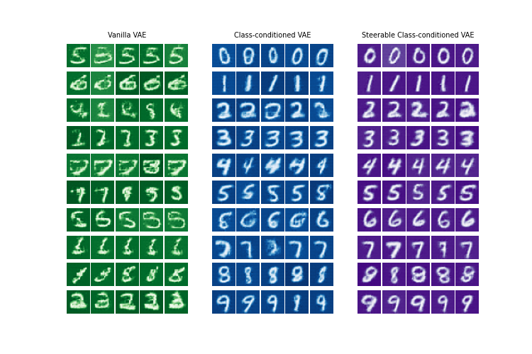
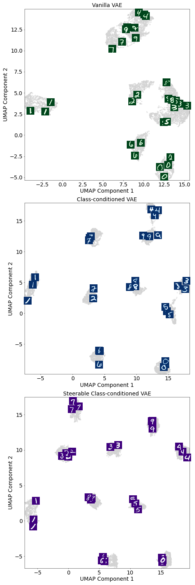
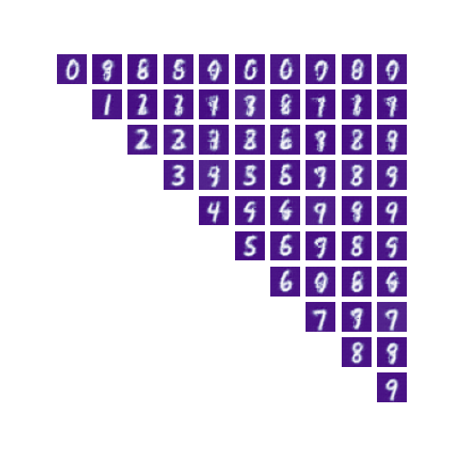

# Steerable Image Generation Transformer

A PyTorch-based **Steerable Vision Transformer Variational Autoencoder (VAE)**. In other words, we created a VAE that can take an optional input which specifies *which* class should be generated from a given latent embedding.


## Table of Contents

- [Analysis](#analysis)
- [Approach](#approach)
  - [Loss Function](#loss-function)
- [Quick Start](#quick-start)
  - [Installation](#installation)
  - [Training](#training)
  - [Model Configuration](#model-configuration)
- [Usage](#usage)
  - [Basic Model Creation](#basic-model-creation)
  - [Training](#training-1)
  - [Generation](#generation)
- [Project Structure](#project-structure)
- [Dependencies](#dependencies)
- [Contributing](#contributing)
- [License](#license)

## Analysis
At a high level, we start with a **Vanilla VAE**, then gradually add more structured supervision to guide its learning. First, we introduce a `class_loss` function, which trains the network to additionally predict the class of the digit. Finally, we add a `steer_loss` function, which trains the network to generate reconstructed images that resemble a **specific target class** of our choosing. By comparing the three models—Vanilla VAE, Class-Loss VAE, and Steerable VAE—we can understand how these loss functions shape both the latent space and the generated images. 



*Generated images for the three different models*

**Vanilla VAE:**  
Even without any class supervision, the Vanilla VAE learns some general statistical structure of MNIST digits: strokes, shapes, and general patterns. However, because it has no notion of classes, it cannot reconstruct a *specific* digit on demand. It simply produces an image that "looks like a digit," but which digit is unpredictable. Conceptually, the network is capturing overall variations in the dataset but not learning meaningful semantic distinctions between classes.  

**Class-Loss VAE:**  
When we add the `class_loss`, the network is forced to predict the correct class of the digit from its embedding. This adds semantic meaning to the latent representation: now, nearby points in latent space correspond to digits of the same class. The predicted labels are also fed back into the decoder, helping the network associate certain latent features with recognizable digit classes. Intuitively, the VAE is no longer just modeling "digit-like shapes," it's starting to understand categories: "this is a 3, that is a 7," and so on. The generated images now reflect this class awareness—they look more like the intended digit class, even if the reconstruction isn't perfectly controlled yet.  

**Steerable VAE:**  
Finally, the `steer_loss` explicitly enforces that the network's output matches a **target class** of our choosing. Now we have full control: we can take a latent vector and tell the network to reconstruct it as a 2 or an 8, and it will comply. The network learns to separate the notion of "what is in the latent vector" from "what class to generate," allowing fine-grained steering of the outputs. Conceptually, this is what makes the VAE *steerable*: we can guide generation along meaningful semantic directions.  



*Embeddings (last layer before encoding classification layer) for different models*

Looking at the embeddings gives us a clear picture of how each modification affects representation learning. The Vanilla VAE produces overlapping embeddings for similar digits—its latent space captures overall structure but not class-specific details. Adding class supervision (Class-Loss VAE) separates the classes more cleanly, creating clusters for each digit. The full Steerable VAE maintains these clusters while also allowing controlled movement along class dimensions, which is what enables targeted image generation.  


*Interpolating between class 2 and class 8*

The power of a steerable VAE is highlighted when we interpolate between classes. For example, we can take a latent vector and interpolate between a one-hot encoding of class 2 and class 8. The generated images smoothly transition from a 2 to an 8. Intuitively, this shows that the network has learned a continuous, semantically meaningful manifold of digits: small changes in the class vector produce small, predictable changes in the output.  



*Interpolation across classes*

We can generalize this idea to interpolate between any two classes. Each row r and column c in the figure corresponds to an image generated from a latent vector combined with a class vector that is 50% class i and 50% class j—effectively the midpoint between the two classes. On the diagonal, the images reproduce individual classes perfectly. Conceptually, this demonstrates that the model's latent space is structured and manipulable: we can generate new, semantically meaningful outputs by steering latent vectors along the axes defined by the class information.


## Approach

The steerable VAE optimizes a multi-objective loss function that combines four key components:

### Loss Function

The total loss combines four components with a 500× weight on the classification loss:

**L_total = L_recon + L_KL + 500 × L_class + L_steer**

#### 1. Reconstruction Loss
**L_recon = (1/N) × Σ||x_i - x̂_i||²**

Ensures accurate reconstruction of input images.

#### 2. KL Divergence Loss  
**L_KL = -(1/2N) × Σ(1 + log(σ²) - μ² - σ²)**

Regularizes the latent space to follow a standard normal distribution.

#### 3. Classification Loss
**L_class = -(1/N) × Σ y_ic × log(p_ic)**

Trains the encoder to correctly classify input images using cross-entropy.

#### 4. Steering Loss
**L_steer = -(1/N) × Σ ỹ_ic × log(p̃_ic)**

Where ỹ are random class labels and p̃ are the predicted classes of generated images. This enforces consistency between intended and generated classes, making the VAE steerable.

### Training Strategy

During training, the model learns to predict classes from the latent representations without teacher forcing. The decoder uses the predicted class probabilities to generate class-consistent images, enabling controlled generation of specific classes.


## Quick Start

### Installation

```bash
# Clone the repository
git clone <your-repo-url>
cd img-gen-transformer

# Create and activate virtual environment
python -m venv .venv
source .venv/bin/activate  # On Windows: .venv\Scripts\activate

# Install dependencies
pip install -r requirements.txt
```

### Training

```bash
# Train the model on MNIST dataset
python train.py
```

This will:
- Download MNIST dataset automatically
- Train the TransformerVAE for 10 epochs
- Generate progress plots every 100 steps
- Create an animated GIF showing training progress
- Save the trained model as `model.pth`

### Model Configuration

The current implementation uses:
- **Dataset**: MNIST (28×28 grayscale images, 10 classes)
- **Model**: 16 embedding dim, 4 attention heads, 5 transformer layers
- **Patches**: 4×4 patch size
- **Training**: Adam optimizer, learning rate 5e-3, batch size 128
- **Loss Weights**: Reconstruction + KL + 500×Classification + Steering loss
- **Training Strategy**: Self-supervised learning without teacher forcing

## Usage

### Basic Model Creation

```python
from network import TransformerVAE

model = TransformerVAE(
    embed_dim=16,         # Embedding dimension
    num_channels=1,       # Grayscale images
    num_heads=4,          # Number of attention heads
    num_layers=5,         # Number of transformer layers
    patch_size=4,         # Size of image patches
    num_classes=10,       # Number of classes (MNIST digits 0-9)
    image_size=(28, 28)   # Input image dimensions
)
```

### Training

```python
from runner import Runner
import torch.optim as optim

optimizer = optim.Adam(model.parameters(), lr=5e-3)
runner = Runner(model, optimizer, device)

# Train the model
runner.train(train_loader, epochs=10)
```

### Generation

```python
# Generate images of specific classes
import torch
import torch.nn.functional as F

# Create one-hot vectors for specific classes
class_0 = torch.eye(10)[0:1]  # Generate digit 0
class_7 = torch.eye(10)[7:8]  # Generate digit 7

# Generate specific digits
z = torch.randn(1, model.embed_dim, device=device)
digit_0 = model.decode(z, class_0)
digit_7 = model.decode(z, class_7)
```


## Project Structure

```
img-gen-transformer/
├── network.py           # Core model architecture
├── runner.py            # Training and generation utilities
├── train.py             # Main training script
├── requirements.txt     # Python dependencies
├── animation.gif        # Training progress animation
└── README.md           # This file
```

## Dependencies

- **PyTorch**: Deep learning framework
- **torchvision**: Computer vision utilities
- **numpy**: Numerical computing
- **tqdm**: Progress bars
- **matplotlib**: Plotting and visualization
- **PIL**: Image processing


## Contributing

Contributions are welcome! Please feel free to submit a Pull Request.

## License

MIT License

Copyright (c) 2025 Jordan Lei

Permission is hereby granted, free of charge, to any person obtaining a copy
of this software and associated documentation files (the "Software"), to deal
in the Software without restriction, including without limitation the rights
to use, copy, modify, merge, publish, distribute, sublicense, and/or sell
copies of the Software, and to permit persons to whom the Software is
furnished to do so, subject to the following conditions:

The above copyright notice and this permission notice shall be included in all
copies or substantial portions of the Software.

THE SOFTWARE IS PROVIDED "AS IS", WITHOUT WARRANTY OF ANY KIND, EXPRESS OR
IMPLIED, INCLUDING BUT NOT LIMITED TO THE WARRANTIES OF MERCHANTABILITY,
FITNESS FOR A PARTICULAR PURPOSE AND NONINFRINGEMENT. IN NO EVENT SHALL THE
AUTHORS OR COPYRIGHT HOLDERS BE LIABLE FOR ANY CLAIM, DAMAGES OR OTHER
LIABILITY, WHETHER IN AN ACTION OF CONTRACT, TORT OR OTHERWISE, ARISING FROM,
OUT OF OR IN CONNECTION WITH THE SOFTWARE OR THE USE OR OTHER DEALINGS IN THE
SOFTWARE.
